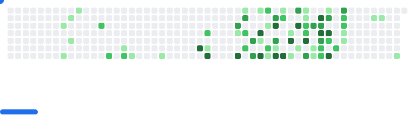

<h3>Hi 👋, I'm FELLAHI Abderraouf</h3>

```json
{
  "name": "FELLAHI Abderraouf",
  "school": "HIGHER NATIONAL SCHOOL of COMPUTER SCIENCE -ESI- Algiers",
  "role": "CEO & Founder of Doxa. Intel's Student Ambassador. Engineer Student",
  "focus": ["Back-end architecture", "Artificial Intelligence", "Game Dev"],
  "description": "Passionate about entreprneurship, technology, and the fusion of code and creativity.",
  "about": {
    "current_study": "Artificial Intelligence & Backend Systems",
    "skills": [
      "Building scalable back-end systems",
      "Training neural networks",
      "Experimenting with generative models for data and art"
    ],
    "passion": "Exploring the intersection of AI & game development (Unity, Godot)",
    "currently_learning": ["Generative AI", "Game Development"],
    "email": "ma_fellahi@esi.dz",
    "fun_fact": "SW1=0x90, SW2=0x00"
  }
}
```

---

### 💼 My Tech Toolbox

<p>
  
  
  
  
  
  
  
  
  
  
  
  
  
  
  
  
  
  
  
  
  
  
  
  
  
  
  
  
  
  
  
  
  
  
  
</p>

<picture>
  <source
    media="(prefers-color-scheme: dark)"
    srcset="images/breakout-dark.svg"
  />
  <source
    media="(prefers-color-scheme: light)"
    srcset="images/breakout-light.svg"
  />
  
</picture>

### 

<br clear="both">

<!-- img src="https://raw.githubusercontent.com/flh-raouf/flh-raouf/output/snake.svg" alt="Snake animation" /-->
---
### 🤝 Let’s Connect & Collaborate

<div align="center">
  <a href="https://www.linkedin.com/in/abderraouf-fellahi/" target="_blank">
    
  </a>
  <a href="https://www.behance.net/fellahiabderra1" target="_blank">
    
  </a>
  <a href="https://www.instagram.com/fellahiabderraouf/?hl=fr" target="_blank">
    
  </a>
  <a href="https://kaggle.com/fellahiabderraouf" target="blank">
        
  </a>
</div>
